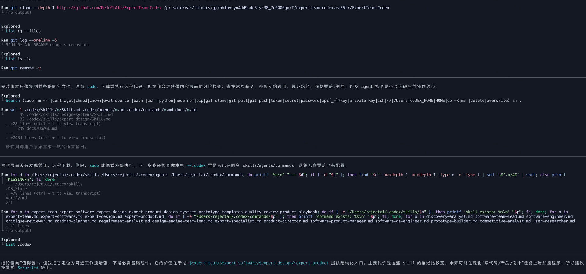
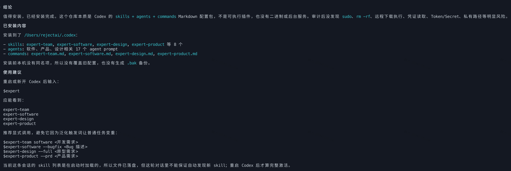
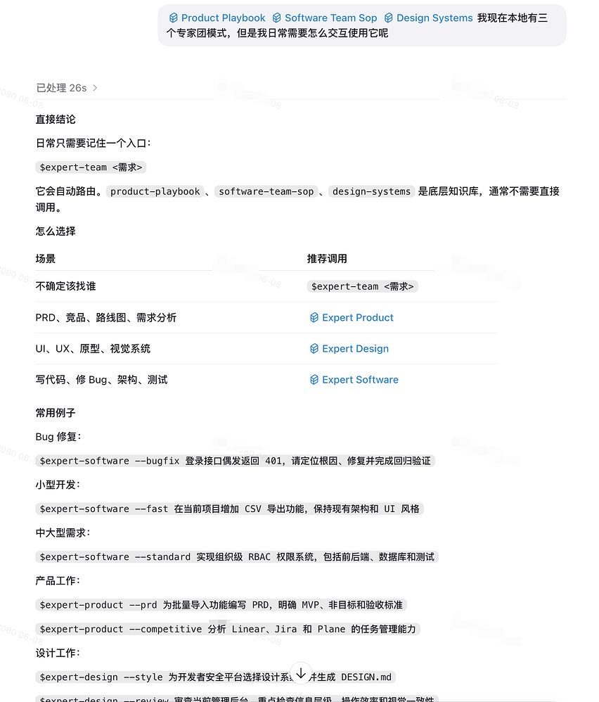

# Codex Expert Teams

一套可直接安装到 `~/.codex` 的专家配置，面向 **Codex CLI / Codex App 桌面版的 Skill 调用方式** 提供 3 个专家团、2 个单专家与 1 个总路由入口。

当前版本：**v1.3.0**。完整更新内容见 [CHANGELOG.md](CHANGELOG.md)。

> 重要：Codex CLI 和 Codex App 桌面版当前主要通过 `$skill-name` 调用 Skill，例如 `$design`。因此本仓库的推荐调用方式是 `$expert-software`、`$expert-design`、`$expert-product`、`$expert-ops`、`$expert-security`、`$expert-team`。

---

## 核心能力

- **软件开发团队**：PRD、架构设计、批量编码、QA 验证、BugFix。
- **设计原型专家团**：需求发现、设计系统选择、高保真原型、质量审查、导出交付。
- **产品战略团队**：PRD、用户研究、竞品分析、指标分析、路线图、Sprint、干系人沟通。
- **基础设施运维专家**：监控告警、云基础设施与 IaC、安全加固、成本优化、备份恢复、容量规划。
- **安全专家**：威胁建模、漏洞评估、安全代码审查、安全架构、事件响应、安全运营、合规审计。
- **专家团总路由器**：根据任务自动选择合适团队或专家，也支持手动指定。

适用场景：想把 Codex 从「单个助手」升级为「可路由、可协作、可复用的专家团系统」。

---

## 目录结构

```text
.
├── .codex/
│   ├── skills/
│   │   ├── expert-team/              # Codex CLI/App 入口：$expert-team
│   │   ├── expert-software/          # Codex CLI/App 入口：$expert-software
│   │   ├── expert-design/            # Codex CLI/App 入口：$expert-design
│   │   ├── expert-product/           # Codex CLI/App 入口：$expert-product
│   │   ├── expert-ops/               # Codex CLI/App 入口：$expert-ops
│   │   ├── expert-security/          # Codex CLI/App 入口：$expert-security
│   │   ├── design-systems/           # 设计系统知识库
│   │   ├── prototype-templates/      # 原型模板
│   │   ├── quality-review/           # 质量审查规则
│   │   └── product-playbook/         # 产品管理手册
│   ├── agents/
│   │   ├── software-team-lead.md
│   │   ├── software-product-manager.md
│   │   ├── software-architect.md
│   │   ├── software-engineer.md
│   │   ├── software-qa-engineer.md
│   │   ├── design-engine-team-lead.md
│   │   ├── discovery-analyst.md
│   │   ├── design-system-expert.md
│   │   ├── prototype-builder.md
│   │   ├── critique-reviewer.md
│   │   ├── export-specialist.md
│   │   ├── product-director.md
│   │   ├── requirement-analyst.md
│   │   ├── user-researcher.md
│   │   ├── competitive-analyst.md
│   │   ├── data-analyst.md
│   │   ├── roadmap-planner.md
│   │   ├── infrastructure-operations-expert.md
│   │   └── security-expert.md
│   └── commands/                     # 可选兼容配置
│       ├── expert-team.md
│       ├── expert-software.md
│       ├── expert-design.md
│       ├── expert-product.md
│       ├── expert-ops.md
│       └── expert-security.md
├── docs/
│   ├── USAGE.md
│   └── TEAM_ARCHITECTURE.md
├── tests/
│   └── install_test.sh
├── CHANGELOG.md
├── VERSION
├── install.sh
├── LICENSE
├── SECURITY.md
└── README.md
```

---

## 文档导航

README 作为快速入口，适合先了解能力范围、安装方式和正式调用命令。更完整的使用方式、团队结构和安全边界请参考：

| 文档 | 内容 | 适合阅读时机 |
|---|---|---|
| [docs/USAGE.md](docs/USAGE.md) | 常用调用方式、跨团队流水线、安装后验证和常见问题排查。 | 安装完成后快速上手，或需要确认 `$expert-*` 的具体用法。 |
| [docs/TEAM_ARCHITECTURE.md](docs/TEAM_ARCHITECTURE.md) | 专家团、Agents、Skills 的组织结构、团队职责、质量门禁和扩展方式。 | 需要理解系统边界，或准备扩展新团队、新 Agent、新 Skill。 |
| [CHANGELOG.md](CHANGELOG.md) | 各版本新增能力、行为变更和问题修复。 | 升级前确认版本差异和兼容性影响。 |
| [docs/RELEASE.md](docs/RELEASE.md) | 发布检查清单、版本更新步骤和验证命令。 | 准备发布新版本或复核 release 流程时。 |
| [SECURITY.md](SECURITY.md) | 仓库安全边界、安装安全提示、使用时需要额外审查的高风险场景和问题报告方式。 | 发布、安装，或将专家团用于认证、支付、隐私、部署等敏感任务前。 |

---

## 快速安装

### 方式 1：远程一键安装

```bash
curl -fsSL https://raw.githubusercontent.com/ReJeCtAll/ExpertTeam-Codex/main/install.sh | bash
```

无需提前克隆仓库。安装脚本会自动：

1. 下载 GitHub 仓库的最新 `main` 分支归档。
2. 创建 `~/.codex/skills`、`~/.codex/agents`、`~/.codex/commands`。
3. 将专家团配置安装到本机 `~/.codex`。
4. 对同名旧文件自动备份到 `~/.codex/backups/expert-team/<timestamp>/`。
5. 完整替换同名组件，避免升级后残留已删除的旧文件。

需要本机已安装 `bash`、`curl` 和 `tar`。如使用了自定义 Codex 目录，可通过 `CODEX_HOME` 指定：

```bash
curl -fsSL https://raw.githubusercontent.com/ReJeCtAll/ExpertTeam-Codex/main/install.sh \
  | CODEX_HOME=/path/to/.codex bash
```

### 方式 2：克隆后审查并安装

适合希望在执行前检查脚本和仓库内容的用户：

```bash
git clone https://github.com/ReJeCtAll/ExpertTeam-Codex.git
cd ExpertTeam-Codex
chmod +x install.sh
./install.sh
```

### 方式 3：手动复制

```bash
mkdir -p ~/.codex/skills ~/.codex/agents ~/.codex/commands
cp -R .codex/skills/* ~/.codex/skills/
cp -R .codex/agents/* ~/.codex/agents/
cp -R .codex/commands/* ~/.codex/commands/
```

---

## Codex CLI 审查式安装截图

若选择克隆后安装，可以先让 Codex CLI 做内容层面的风险检查，确认没有 `sudo`、凭证读取或无备份覆盖等高风险操作：



> 截图展示的是克隆仓库后的本地审查流程。方式一的远程安装会通过 HTTPS 下载本仓库的 `main` 分支归档。

安装完成后，确认 Skills、Agents 和 Commands 已落盘到本机 `~/.codex`：



---

## 安装器回归测试

仓库提供 macOS/Linux 通用安装测试，覆盖：

- 自定义 `CODEX_HOME` 的本地安装。
- 模拟 `curl ... | bash` 的远程归档安装。
- 重复安装时的备份、完整替换和同秒备份唯一性。
- 无效归档的失败提示和非零退出状态。

本地运行：

```bash
tests/install_test.sh
```

GitHub Actions 会在 `ubuntu-latest` 和 `macos-latest` 上自动执行同一套测试。

---

## 版本管理

项目使用语义化版本：

- `VERSION`：记录当前发布版本，是安装器输出和发布标签的版本来源。
- `CHANGELOG.md`：记录每个版本的新增、变更和修复。
- Git 标签：使用 `v<major>.<minor>.<patch>`，例如 `v1.3.0`。

版本升级规则：

- 主版本：不兼容的入口、配置格式或安装行为变更。
- 次版本：向后兼容的新专家、新能力或新工作流。
- 修订版本：向后兼容的问题修复和文档修正。

---

## Codex CLI / Codex App 桌面版可用命令

### 总路由

```text
$expert-team <你的需求>
$expert-team software <软件开发需求>
$expert-team design <设计原型需求>
$expert-team product <产品战略需求>
$expert-team ops <基础设施运维需求>
$expert-team security <安全审计/威胁建模/合规需求>
```

### 软件开发团队

```text
$expert-software --fast <小型功能/单页应用/工具脚本>
$expert-software --bugfix <Bug 描述、复现步骤、期望行为>
$expert-software --standard <中大型软件需求>
$expert-software --prd <只输出 PRD>
$expert-software --arch <只做架构设计与任务分解>
$expert-software --code <基于现有设计实现代码>
$expert-software --test <只做测试与回归验证>
```

### 设计原型专家团

```text
$expert-design --full <从需求发现到原型导出完整流程>
$expert-design --style <只推荐设计系统/视觉风格/设计令牌>
$expert-design --review <审查现有原型或页面质量>
$expert-design --export <导出已有原型为 HTML/PDF/PPTX/ZIP>
```

### 产品战略团队

```text
$expert-product --prd <功能规格书/PRD/需求分析>
$expert-product --competitive <竞品分析/市场定位/Battle Card>
$expert-product --research <用户访谈/问卷/NPS/反馈综合>
$expert-product --metrics <产品指标/漏斗/留存/异常分析>
$expert-product --roadmap <路线图/季度规划/优先级排序>
$expert-product --sprint <Sprint 规划/故事拆分/容量评估>
$expert-product --stakeholder <周报/月报/项目进展/高管更新>
$expert-product --brainstorm <产品创意发散与收敛>
```

### 基础设施运维专家

```text
$expert-ops --monitor <Prometheus/Grafana 监控告警方案>
$expert-ops --infra <云基础设施与 IaC 架构设计>
$expert-ops --security <安全审计与加固方案>
$expert-ops --cost <基础设施成本分析与优化>
$expert-ops --backup <备份与灾难恢复方案>
$expert-ops --capacity <容量规划与增长预测>
$expert-ops --full <完整基础设施健康评估>
```

### 安全专家

```text
$expert-security --protect <零信任架构/DevSecOps/安全基线方案>
$expert-security --detect <OWASP Top 10/API/依赖漏洞/入侵检测评估>
$expert-security --ops <事件响应/SOC/漏洞管理生命周期/安全运营>
$expert-security --audit <全面安全审计报告>
$expert-security --threat <STRIDE 威胁建模>
$expert-security --incident <事件响应预案 IRP>
$expert-security --code-review <安全代码审查>
$expert-security --compliance <等保/SOC2/ISO27001/GDPR 合规差距分析>
$expert-security --full <完整安全健康评估>
```

---

## 安装后验证

在 Codex CLI 或 Codex App 桌面版输入：

```text
$expert
```

如果能看到类似以下 Skill，说明安装成功：

```text
expert-team
expert-software
expert-design
expert-product
expert-ops
expert-security
```

然后测试：

```text
$expert-software --fast 做一个 Todo App
```

---

## 使用截图

安装完成后，在 Codex CLI 或 Codex App 桌面版输入 `$expert`，可以看到专家团 Skills 候选：


日常使用时可以优先从 `$expert-team` 进入，由总路由根据需求分流到产品、设计、软件开发团队、基础设施运维专家或安全专家：



---

## Codex App 桌面版说明

Codex App 桌面版与 Codex CLI 保持同样用法：

```text
$expert-software --fast 做一个 Todo App
$expert-design --full 做一个 AI Agent 平台 Landing Page
$expert-product --prd 写一个 AI 笔记功能 PRD
$expert-ops --monitor 为生产服务设计监控告警方案
$expert-security --threat 对用户认证模块做 STRIDE 威胁建模
$expert-team product 分析 AI 笔记产品的竞品和路线图
```

验证方式同样是输入：

```text
$expert
```

若能看到 `expert-team`、`expert-software`、`expert-design`、`expert-product`、`expert-ops`、`expert-security`，说明桌面版已识别这些专家 Skills。

---

## 推荐流水线

从 0 到 1 做产品：

```text
$expert-product --prd <产品想法>
$expert-security --protect <基于 PRD 前置安全和隐私要求>
$expert-design --full <基于 PRD 做高保真原型>
$expert-software --standard <基于 PRD 和原型实现工程代码>
$expert-security --code-review <上线前安全代码审查>
$expert-ops --full <基于系统架构设计部署、监控和运维方案>
```

小型功能或工具：

```text
$expert-software --fast <需求>
```

只做视觉原型：

```text
$expert-design --full <页面或产品原型需求>
```

## 设计原则

- **专家团路由**：让任务先进入正确团队，而不是一个助手包办所有事情。
- **主理人编排**：每个团队都有 Lead Agent，负责拆分、转交、汇总和收口。
- **单专家直达**：运维和安全任务由对应单专家直接处理，避免为单一职责引入虚假团队结构。
- **质量门禁**：软件团队有工程一致性与 QA 路由；设计团队有 5 维评分与 Anti-Slop 检查；产品团队有结构化报告与行动清单；运维专家有事实基线、变更回滚和验证要求；安全专家有授权范围、证据链、风险分级和验证闭环。
- **可复用配置**：Skills、Agents、Commands 分离，方便单独替换或扩展。
- **安全默认值**：安装脚本备份同名文件；仓库不包含密钥、Token 或个人绝对路径。

---

## 兼容性说明

| 环境能力 | 推荐入口 | 效果 |
|---|---|---|
| Codex CLI 支持 Skills | `$expert-*` | 推荐，当前主入口 |
| Codex App 桌面版支持 Skills | `$expert-*` | 与 CLI 同样用法 |
| 可选 Slash Commands 兼容层 | `.codex/commands/expert-*.md` | 仅用于仍读取 commands 的旧环境 |
| 环境支持 Agents | `$expert-*` + agents | 更接近多角色专家团 |
| 只支持普通对话 | 复制 Skill 内容 | 可作为结构化 Prompt 使用 |

---

## 🔗 Friendly Links

- [LinuxDo](https://linux.do/) — a community of people who love technology.

---

## 开源协议

MIT License。详见 [LICENSE](LICENSE)。

---

## 贡献建议

欢迎提交：

- 新专家团模板
- 更细的 Agent 角色
- 更严格的质量门禁
- 更好的跨团队流水线
- 不同技术栈或行业场景的 Skills
